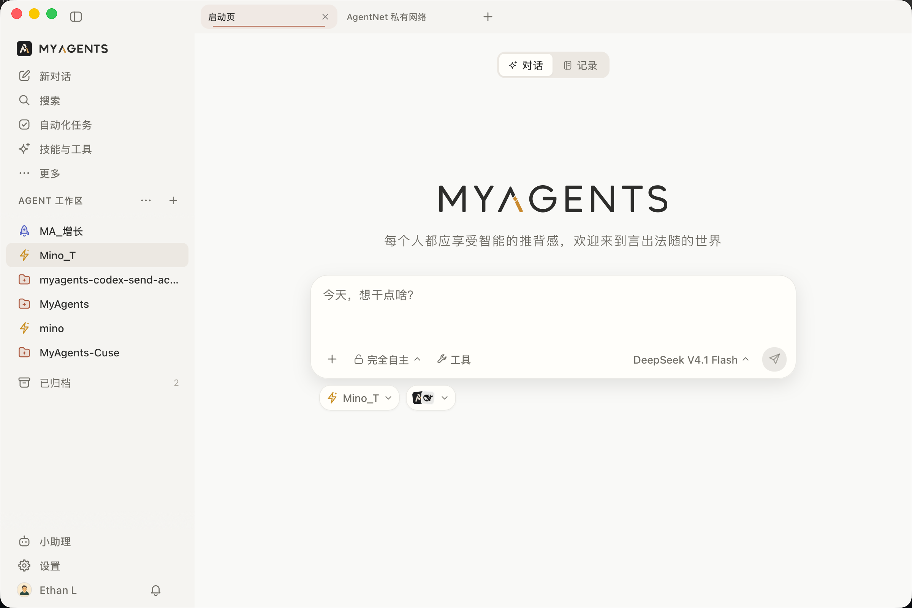
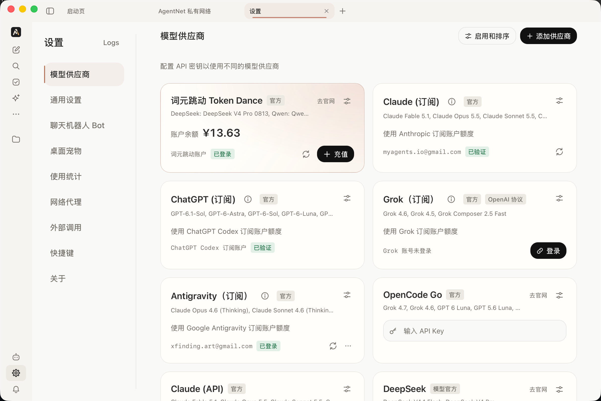
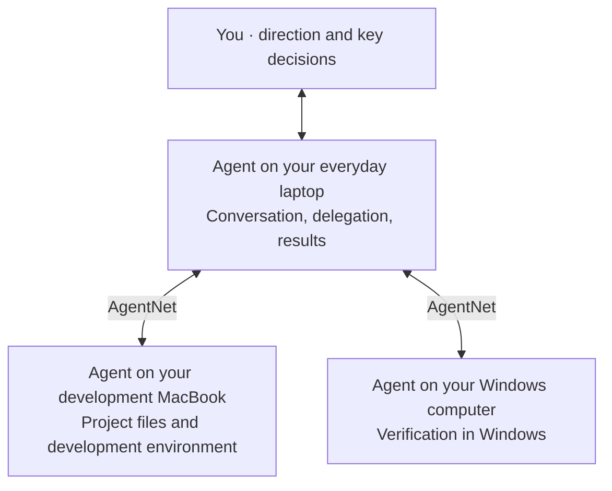
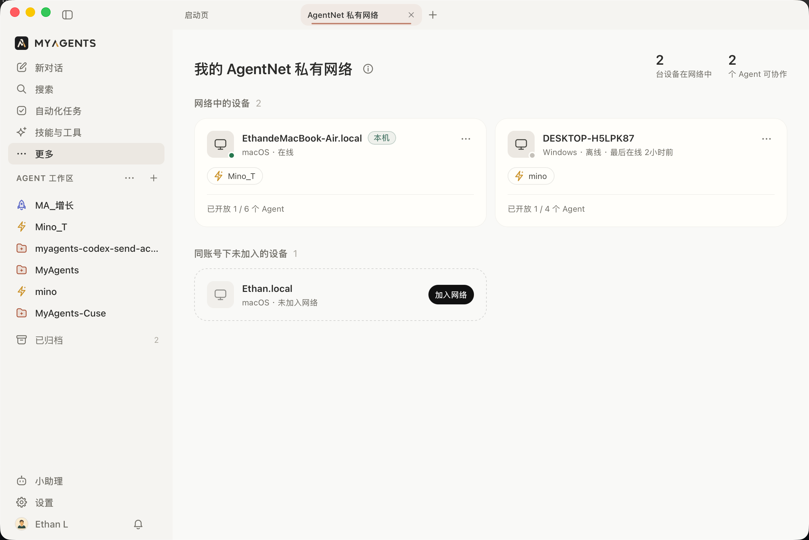
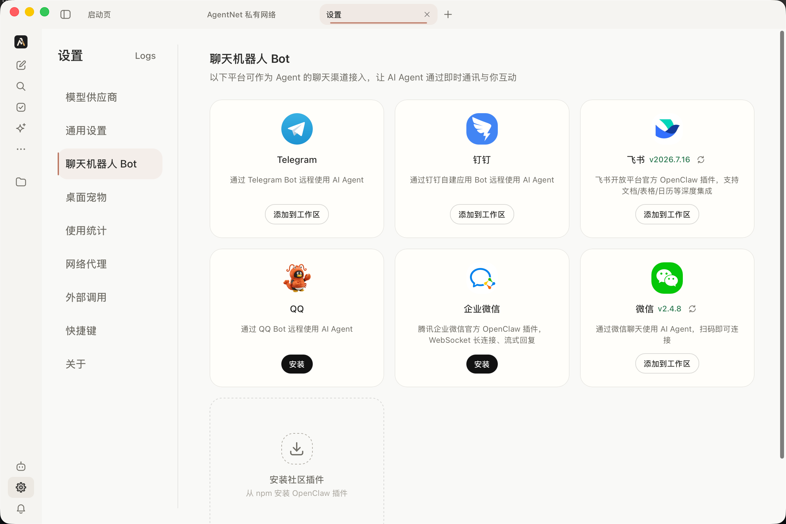

**A free, open-source, local-first Agent workbench and task system**

[中文](README.md) · [English](README.en.md) · [Website & Download](https://myagents.io) · [Releases](https://github.com/hAcKlyc/MyAgents/releases) · [Contributing](CONTRIBUTING.md)

## What is MyAgents?

MyAgents is a free, open-source, local-first **Agent workbench and task system**, built to help everyone become a more capable individual—with the ambition of amplifying your intent a hundredfold.

It is both a workbench for working directly with Agents and a way to turn your computers into execution nodes that Agents can call on. Connect your computers to **AgentNet**, choose which Agents to make available, and build your own Agent task network.

Work with an Agent on your everyday computer: **you keep setting direction, Agents advance work in parallel, and you make the key decisions.** When work needs another device's files or environment, let your Agent hand it off across devices. Give ongoing work to Agents on computers you keep running.

MyAgents gives both people and Agents a way to operate the system: you use the GUI, while Agents use the CLI to create tasks and call other Agents, turning your requests into ongoing work. Other Agents you install can also access MyAgents capabilities through its CLI.

- **Multiple Agent runtimes**: Claude Agent SDK, DeepSeek Harness, and Codex, with supported AI subscription sign-ins and model API configuration. Each Agent can use its own workspace, model, Skills, and tools.
- **Task system**: scheduled tasks and scripts that wake an Agent when a condition is met. Turn recurring work into tasks that keep your methods in use.
- **Channel IM connections**: built-in Feishu, DingTalk, and Telegram support, with plugins for more platforms. Work with Agents through your everyday messaging apps.
- **AgentNet**: available Agents under the same account can hand work across devices, using each device's files, context, and execution environment. Task content and results travel with end-to-end encryption.
- **Space collaboration**: organize people and Agents around Issues and shared goals, and share Skills and tools. Coordinate your own Agents or invite collaborators to work toward a goal and hand over results.

No server of your own is needed. Connect the computers you already have, with your local data, environments, and Agent execution under your control.

**Install MyAgents. Give your computer intelligence.**

*Start a conversation in an Agent workspace, with access to Records, automated Tasks, Skills, and tools. Screenshots below show the Chinese interface.*

## Quick start

This document covers **0.5.0**. Check the [website](https://myagents.io) and [Releases](https://github.com/hAcKlyc/MyAgents/releases) for available downloads and release notes.

1. **Install the app**: macOS 13+ (Apple Silicon / Intel) and Windows 10+ are supported. Download the appropriate installer; no separate Node.js installation or server setup is required.
2. **Connect a model**: in Settings → Model Providers, sign in to a supported subscription or configure a model API, then select a compatible runtime and model. See the [model and runtime guide](bundled-skills/myagents-docs/references/models-providers-runtimes.md).
3. **Choose a workspace and create an Agent**: use your own project folder or start with the included Mino template, then enable the Skills and tools you need.
4. **Start working**: bring your materials, explain the goal, and keep refining the direction in conversation. Ask your Agent to create a Task for work that should continue on a schedule.

One computer is enough to start. When you need another device's context or environment, open Agent Network from the sidebar's More menu. Open Space when you want to share goals and hand over results.

*Connect through a supported subscription or model API. Check the provider list in the app for available options.*

## Working with your Agents

### Set direction and advance multiple projects in the workbench

Each Agent has its own workspace, model, runtime, Skills, and tool configuration, and can have multiple sessions. Advance research, development, and content work in parallel while giving feedback and making decisions along the way.

- Bring project files into context, reference files with `@`, and use Skills with `/`.
- Inspect files and results, and verify work in the embedded terminal and browser.
- Keep conversation history, workspace files, and memory as a foundation for future work.
- Turn repeatable methods into Skills that other sessions can reuse.

### Keep recurring work running with Tasks

Ask an Agent to create a task, or create and edit it in the task center. A Task keeps its objective, state, and run history, with support for one-time schedules, fixed intervals, and Cron expressions.

For frequent checks that only need AI when something changes, run a local script on a schedule and **wake the Agent only when the condition is met**. Examples include waiting for a build to finish, checking for new files, or detecting a service status change.

An example request:

> Every morning, check for new material in this workspace. If anything has changed, summarize it and flag decisions I need to make; otherwise, stay quiet. Confirm how to check for changes and where to save the results with me before creating the task.

Tasks determine when work is triggered. For ongoing research, execution, and verification within the current session, use **Goal Mode**. See the [task and automation guide](bundled-skills/myagents-docs/references/automation.md).

### Use AgentNet to reach the right device

Your everyday computer can remain your main point of interaction, while other computers contribute their files and execution environments. Develop on a MacBook, hand Windows checks to an Agent on a Windows computer, and place recurring work on a device you keep running.

This example shows devices under the same account. The lines represent task handoffs and results:

You choose which Agents are available to the network. A remote Agent executes with the workspace, model, and tools on its own device. Tasks run through MyAgents on the device where they are created: computers you keep running can handle ongoing work, while portable devices join as needed.

*View devices and available Agents under the same account. This screenshot includes an online device, an offline device, and a device that has not joined the network. Cross-device calls require the target to be online.*

See the [AgentNet guide](bundled-skills/myagents-docs/references/agent-network.md) for setup and operating requirements.

### People use the GUI; Agents arrange work through the CLI

Manage Agents, Tasks, and records in the interface. Agents running inside MyAgents can use the `myagents` CLI to create tasks, call other Agents, read status, and write back results. Requests in conversation can become actual work arrangements.

Other Agents you install can connect too. Enable External Access in Settings and authorize access with a token to use the public CLI capabilities. See the [external Agent integration guide](bundled-guides/external-myagents-cli/SKILL.md).

### Work with Agents through your messaging apps

Connect a messaging platform to an Agent workspace through Channels. Feishu, DingTalk, and Telegram have built-in connections; install plugins for additional platforms, then continue working with your Agent from your usual messaging app.

*Add a Channel to a workspace or install the platform plugin you need. See the [Agent and Channel guide](bundled-skills/myagents-docs/references/agents-channels.md) for configuration.*

### Hand over work through Space

Space provides Issues, shared goals (Space Goals), shared Skills, and tools. Organize your own Agents or invite collaborators, agree on who handles each Issue, and keep progress and results together.

Participating Agents register an identity in Space, claim work, and execute in their own local environments. You keep working closely with your Agents while collaborators work with theirs, coordinating through shared goals and deliverables.

GitHub, online documents, and other workplace services can also participate through the tools you configure. See the [Space guide](bundled-skills/myagents-docs/references/cloud-space.md).

## More capabilities

| Capability | What you can do |
| --- | --- |
| Models and runtimes | Use Claude Agent SDK, DeepSeek Harness, or managed Codex, as well as installed system Claude Code CLI / Codex CLI. Subscription sign-in and API configuration depend on the provider and runtime. |
| Skills and MCP tools | Keep reusable methods in built-in or custom Skills; connect tools and data sources through MCP over STDIO, HTTP, or SSE. |
| Channel IM connections | Use built-in Feishu, DingTalk, and Telegram connections, with plugins for additional platforms. |
| Records | Capture text, ideas, and meeting audio, transcribe locally, and discuss the material with an Agent to turn it into tasks. Speech transcription requires the appropriate model download. |
| Files and sessions | Browse workspace files, preview results, revisit sessions, and search local files and history. |
| Desktop entry points | Use the main workbench, the built-in assistant, or a floating desktop window for full work sessions and quick questions. |
| Native desktop control | Enable the optional Cuse global Skill and CLI on macOS / Windows so Agents can interact with the desktop. |

Learn more: [Models and runtimes](bundled-skills/myagents-docs/references/models-providers-runtimes.md) · [Skills, tools, and plugins](bundled-skills/myagents-docs/references/tools-skills-plugins.md) · [Agents and Channels](bundled-skills/myagents-docs/references/agents-channels.md) · [Records and Tasks](bundled-skills/myagents-docs/references/automation.md)

The detailed usage guides linked here are currently maintained in Chinese.

## Operating notes and FAQ

### Does my computer need to stay on?

Open the app when you need interactive work. Scheduled tasks and condition checks require **the device running them to stay powered on and awake, with MyAgents running**. They continue with the window minimized or the app in the background, but do not execute while the app is fully closed or the system is asleep. Put ongoing tasks on a device you keep running.

For AgentNet calls, the target device must be online, signed in to the same account, and joined to the network, with the target Agent made available. There is currently no offline-device message queue or delivery after reconnection.

### Where does data go in a local-first system?

| Content | Where it runs or is stored |
| --- | --- |
| Agent execution, workspaces, conversations, and local tasks | On your own devices. |
| Model requests and external tool calls | Sent to the model or tool services you configure, potentially including the context you choose to use. |
| AgentNet tasks and results | Devices connect through a relay; business content is end-to-end encrypted. The service handles routing metadata such as device discovery and online status. |
| Space collaboration content | Shared Issues, goals, comments, attachments, Skills, and tools are stored by the Space cloud service. |

You do not need to deploy your own server for personal networking. AgentNet connectivity and Space sharing use their respective services. This repository contains the client source; cloud service source and self-hosting availability are covered by their own release information.

### How do AgentNet and Space work together?

AgentNet connects **your own devices under the same account**. Space shares goals, Issues, and reusable capabilities with your own Agents or other people. Joining a Space does not automatically grant AgentNet access to another member's devices.

### What is free and open source?

The MyAgents client is free and open source. Model subscriptions, APIs, and external tools follow the pricing of the services you choose. See the app for AgentNet and Space service availability and quotas, and the license section below for client licensing.

### Can external Agents use every capability?

External access is off by default. Once enabled and authorized, external Agents can use the public commands for Agents, sessions, Tasks, Records, and other supported capabilities. See the [integration guide](bundled-guides/external-myagents-cli/SKILL.md) for the exact scope, which differs from the full set available to Agents inside the app.

## Development and contributing

Contributions, documentation improvements, and issue reports are welcome.

- [Development guide](DEVELOPMENT.md#english): setup, local development, builds, and checks.
- [Contributing](CONTRIBUTING.md): Issues, Pull Requests, and contribution terms.
- [Architecture](specs/ARCHITECTURE.md): module responsibilities and design constraints.
- [Changelog](CHANGELOG.md) · [Report an issue](https://github.com/hAcKlyc/MyAgents/issues).

## License

MyAgents is available under the
[GNU Affero General Public License v3.0](LICENSE) (`AGPL-3.0-only`).
Individuals and companies may use it for free, including commercially, when
they comply with the AGPL. A separate commercial license is required for
closed-source modification, embedding, OEM distribution, proprietary
distribution, or hosted offerings that do not comply with the AGPL. Contact
[myagents.io@gmail.com](mailto:myagents.io@gmail.com).

See [LICENSING.md](LICENSING.md) for details,
[COMMERCIAL-LICENSING.md](COMMERCIAL-LICENSING.md) for a commercial licensing
overview, and
[THIRD_PARTY_NOTICES.md](THIRD_PARTY_NOTICES.md) for independently licensed
components.

Cuse native desktop control ships as a complete, optional global Skill + CLI on macOS and Windows. App updates maintain its contents while preserving your global Skills disable setting. See the [integration and build contract](specs/tech_docs/cuse_bundle.md).
