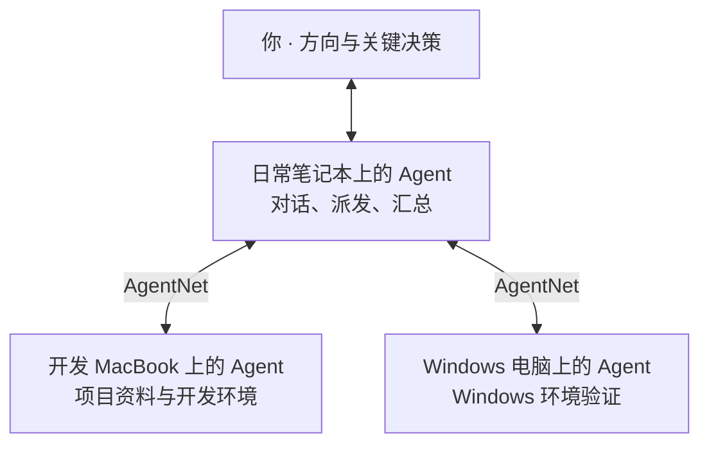

**免费开源、本地优先的 Agent 工作台与任务系统**

[中文](README.md) · [English](README.en.md) · [官网与下载](https://myagents.io) · [Releases](https://github.com/hAcKlyc/MyAgents/releases) · [贡献指南](CONTRIBUTING.md)

## MyAgents 是什么

MyAgents 是一个免费开源、本地优先的 **Agent 工作台与任务系统**，致力于帮助每个人成为超级个体，百倍放大你的意志。

它既是你与 Agent 直接协作的工作台，也让你的电脑成为可被 Agent 调用的执行节点。将自己的多台电脑接入 **AgentNet**，选择开放的 Agent，就能组成属于你的 Agent 任务网络。

你可以在日常使用的电脑上与 Agent 对话工作：**你持续提出方向，Agent 并行推进，你作出关键决策。** 需要其他设备上的资料或环境时，让 Agent 跨设备派发任务、传递信息；需要长期运行的事务，则交给常开设备上的 Agent 持续推进。

MyAgents 同时为人和 Agent 提供操作入口：你通过GUI使用， Agent 通过 CLI 建立任务、调用其他 Agent，把你的要求落实为持续运转的工作安排。你安装的其他 Agent 也可以通过 CLI 使用 MyAgents 的各项能力。

- **多种 Agent Runtime**：集成 Claude Agent SDK、DeepSeek Harness 和 Codex，支持多种 AI 订阅登录，也可以配置模型 API。每个 Agent 都可以使用自己的工作区、模型、Skill 和工具。
- **Task 任务系统**：支持定时任务，以及定时运行脚本、满足条件后唤醒 Agent 的自动化。把日常事务交给任务系统，让有效的方法持续运行。
- **Channel IM 通道**：内置飞书、钉钉、Telegram 接入，并通过插件扩展更多平台，让你从常用的消息软件与 Agent 协作。
- **AgentNet 网络**：同一账号下已开放的 Agent 可以跨设备交接工作，使用各自的资料、上下文与执行环境。设备之间的任务与结果通过端到端加密传递。
- **Space 协作空间**：通过 Issue 和共同目标组织人和 Agent 的协作，共享 Skill 与工具。既可以安排自己的多个 Agent，也可以邀请合作方，围绕目标推进、交接结果。

不需要服务器，只用你的几台电脑就能组网，数据、环境、Agent 运行在本地，一切尽藏掌握之中。

**安装 MyAgents，赋予你的电脑以智能。**

*从自己的 Agent 工作区开始对话，随时进入记录、自动化任务、技能与工具。*

## 快速开始

本文面向 **0.5.0**。可下载版本与发布说明请以[官网](https://myagents.io)和 [Releases](https://github.com/hAcKlyc/MyAgents/releases) 为准。

1. **安装客户端**：支持 macOS 13+（Apple Silicon / Intel）和 Windows 10+。下载对应安装包即可开始，无需自行安装 Node.js 或搭建服务器。
2. **接入模型**：在「设置 → 模型供应商」中登录支持的订阅，或填写模型 API 配置，再选择匹配的 Runtime 与模型。具体接入方式见[模型与 Runtime 指南](bundled-skills/myagents-docs/references/models-providers-runtimes.md)。
3. **选择工作区、创建 Agent**：可以使用自己的项目目录，也可以从内置 Mino 模板开始，为 Agent 配好需要的 Skill 与工具。
4. **开始工作**：带上资料说明目标，在对话中不断调整方向；需要持续处理的事务，让 Agent 帮你建立 Task。

一台电脑就能完成这些工作。需要其他设备的资料或环境时，再从侧栏「更多 → Agent 网络」接入 AgentNet；需要共享目标和交接结果时，再打开「协作空间」。

*按自己的订阅或 API 配置接入模型，具体选项以应用内供应商列表为准。*

## 怎样与你的 Agent 一起工作

### 在工作台里对齐方向，推进多项工作

每个 Agent 都有自己的工作区、模型、Runtime、Skill 和工具配置，可以开启多个会话。你可以同时推进研究、开发、内容整理等不同工作，并在过程中给出反馈、作出关键决策。

- 把文件和项目资料作为上下文，通过 `@` 引用文件、`/` 使用 Skill。
- 在同一个窗口中查看文件、预览结果、使用终端和浏览器验证工作。
- 保留会话历史、工作区文件和记忆，让后续工作接着已有积累展开。
- 把反复使用的方法整理为 Skill，让其他会话也能复用。

### 把日常事务交给 Task 持续运行

你可以直接让 Agent 把一项工作建立为任务，也可以在任务中心创建和编辑。Task 保存目标、状态和运行记录，支持指定时间执行一次、固定间隔与 Cron 定时执行。

对于“经常检查，但只有变化时才需要 AI”的事务，可以先定时运行本地脚本，**满足条件后再唤醒 Agent**。例如检查构建是否完成、有无新文件，或某个服务状态是否变化。

一个适合交给 Agent 配置的任务：

> 每天上午检查这个工作区的新资料；有更新时整理摘要和需要我决定的事项，没有更新就保持安静。先和我确认检查方式与结果保存位置，再建立任务。

Task 安排工作何时触发；如果当前会话需要围绕一个目标持续研究、执行和验证，可以使用 **Goal Mode**。两者的用法见[任务与自动化指南](bundled-skills/myagents-docs/references/automation.md)。

### 用 AgentNet 调用合适的设备

你的日常电脑可以是主要交互入口，其他电脑提供各自的资料与执行环境。比如开发在一台 MacBook 上推进，需要 Windows 验证时，交给 Windows 电脑上的 Agent；需要定时持续运行的工作，安排在常开设备上。

下面是同一账号下的设备分工示意，连线表示任务与结果的交接：

你选择哪些 Agent 对网络开放，远端 Agent 使用它所在设备的工作区、模型与工具执行。任务放在哪台设备上，就由那台设备上的 MyAgents 负责运行；常开设备可以承担长期任务，随身电脑按需接入。

*查看同一账号下的设备及已开放的 Agent。图中展示两台在线设备和一台尚未加入网络的设备；跨设备调用需要目标设备在线。*

接入方式与运行条件见 [AgentNet 指南](bundled-skills/myagents-docs/references/agent-network.md)。

### 人通过 GUI 操作，Agent 通过 CLI 安排工作

你可以在界面中管理 Agent、Task 和工作记录，MyAgents 内运行的 Agent 也可以通过 `myagents` CLI 建立任务、调用其他 Agent、读取状态、回写结果。对话里的要求由此可以成为真正的任务安排。

你安装的其他 Agent 同样可以接入：在「设置 → 外部调用」中启用功能并完成令牌授权后，通过公开 CLI 能力使用 MyAgents。支持范围与接入步骤见[外部 Agent 接入指南](bundled-guides/external-myagents-cli/SKILL.md)。

### 从常用的消息软件与 Agent 协作

通过 Channel 将消息平台接入 Agent 工作区。飞书、钉钉、Telegram 提供内置接入，更多平台可以安装插件扩展；接入后，在常用的消息软件中继续与 Agent 工作。

*将通道添加到工作区，或安装所需的平台插件；具体配置见 [Agent 与 Channel 指南](bundled-skills/myagents-docs/references/agents-channels.md)。*

### 用 Space 围绕目标交接结果

Space 提供 Issue、共同目标（Space Goal）、共享 Skill 和工具。你可以组织自己的多个 Agent，也可以邀请合作方，明确谁处理哪些 Issue，把进展与结果留在同一个空间。

参与的 Agent 在 Space 中登记身份、认领工作，再回到自己的本地环境执行。你与自己的 Agent 持续互动，合作方也与他们的 Agent 推进工作，彼此围绕目标与交付协作。

已有的 GitHub、在线文档和办公系统也可以通过相应工具接入工作流程。Space 的使用方式见[协作空间指南](bundled-skills/myagents-docs/references/cloud-space.md)。

## 更多工作能力

| 能力 | 怎么使用 |
| --- | --- |
| 多模型与 Runtime | 集成 Claude Agent SDK、DeepSeek Harness 与托管 Codex；也支持已安装的系统 Claude Code CLI / Codex CLI。订阅登录与 API 配置按所选供应商和 Runtime 使用。 |
| Skill 与 MCP 工具 | 使用内置或自定义 Skill 沉淀方法，通过 MCP 连接工具与数据源；支持 STDIO、HTTP、SSE 接入。 |
| Channel IM 通道 | 内置飞书、钉钉、Telegram；通过插件扩展其他平台，在常用消息软件中与 Agent 协作。 |
| Record 记录 | 收集文字、想法与会议录音，支持本地语音转写，再与 Agent 讨论并整理成任务；语音转写需安装对应模型。 |
| 文件与会话 | 工作区文件树、预览、历史会话与本地全文搜索，方便找到已有资料和工作结果。 |
| 桌面入口 | 主工作台、小助理和桌面浮窗，适合完整工作与临时提问。 |
| 本机桌面操作 | macOS / Windows 提供可选的 Cuse 全局 Skill 与 CLI，让 Agent 使用本机桌面操作能力。 |

进一步了解：[模型与 Runtime](bundled-skills/myagents-docs/references/models-providers-runtimes.md) · [Skill、工具与插件](bundled-skills/myagents-docs/references/tools-skills-plugins.md) · [Agent 与 Channel](bundled-skills/myagents-docs/references/agents-channels.md) · [Record 与 Task](bundled-skills/myagents-docs/references/automation.md)

## 运行说明与常见问题

### 需要一直开着电脑吗？

交互式工作按需打开即可。定时任务和条件检测要求**执行它们的设备开机、保持唤醒，MyAgents 继续运行**；窗口最小化或后台驻留可以继续工作，完全退出应用或系统休眠期间不会执行。长期任务适合交给常开设备。

AgentNet 调用时，目标设备需要在线、登录同一账号并加入网络，目标 Agent 需要已开放。当前不提供面向离线设备的消息排队与恢复后补投。

### Local-first 下，数据在哪里？

| 内容 | 处理位置 |
| --- | --- |
| Agent 执行环境、工作区、会话与本地任务 | 在自己的设备上运行或保存。 |
| 模型请求与外部工具调用 | 按你的配置发送到相应模型或工具服务，可能包含你选择使用的上下文。 |
| AgentNet 任务与结果 | 通过中继连接设备，业务内容端到端加密；设备发现、在线状态等路由元数据由服务处理。 |
| Space 协作内容 | 你共享的 Issue、目标、评论、附件、Skill 与工具等内容由 Space 云服务保存。 |

个人组网无需自行部署服务器；AgentNet 的连接和 Space 的共享由相应服务提供。客户端源码可在本仓库查看，云服务的源码与自部署可用性以各自发布信息为准。

### AgentNet 和 Space 怎样配合？

AgentNet 用于**同一账号下自己的设备**之间调用 Agent。Space 用于共享目标、Issue 和可复用能力，成员可以是你自己，也可以是合作方。加入同一个 Space 不会自动获得对方设备上的 AgentNet 调用权限。

### 免费开源包含什么？

MyAgents 客户端免费开源。你选择的模型订阅、API 或外部工具按对应服务的规则计费；AgentNet 与 Space 的服务范围、额度以产品内说明为准。客户端许可见下文。

### 外部 Agent 可以操作全部功能吗？

外部调用默认关闭。启用并授权后，外部 Agent 可以使用公开命令提供的 Agent、会话、Task、Record 等能力；具体范围见[接入指南](bundled-guides/external-myagents-cli/SKILL.md)，与应用内 Agent 的完整操作范围有所区别。

## 开发与贡献

欢迎提交问题、改进文档或贡献代码。

- [开发指引](DEVELOPMENT.md)：环境准备、本地开发、构建与检查。
- [贡献指南](CONTRIBUTING.md)：Issue、Pull Request 与贡献约定。
- [架构文档](specs/ARCHITECTURE.md)：模块职责与设计约束。
- [更新日志](CHANGELOG.md) · [问题反馈](https://github.com/hAcKlyc/MyAgents/issues)。

## 许可证

MyAgents 采用 [GNU Affero General Public License v3.0](LICENSE)
（`AGPL-3.0-only`）。个人和企业都可以免费使用，也可以商业使用；分发修改版、通过网络向
用户提供修改版等场景需要完整履行 AGPL，包括在适用时提供对应源码。

如果你希望在不履行 AGPL 开源义务的情况下闭源修改、嵌入、OEM、分发或托管 MyAgents，
需要取得单独的商业许可证。请联系
[myagents.io@gmail.com](mailto:myagents.io@gmail.com)。

完整说明见 [LICENSING.md](LICENSING.md)，商业许可概要见
[COMMERCIAL-LICENSING.md](COMMERCIAL-LICENSING.md)。第三方组件继续适用各自许可证，详见
[THIRD_PARTY_NOTICES.md](THIRD_PARTY_NOTICES.md)。

[Read this document in English →](README.en.md)
